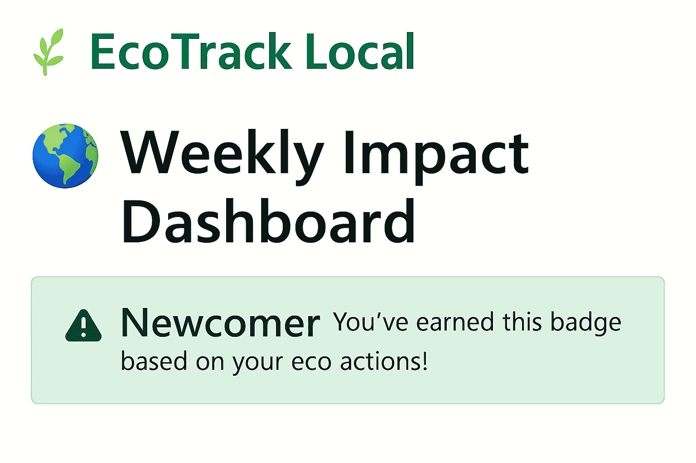
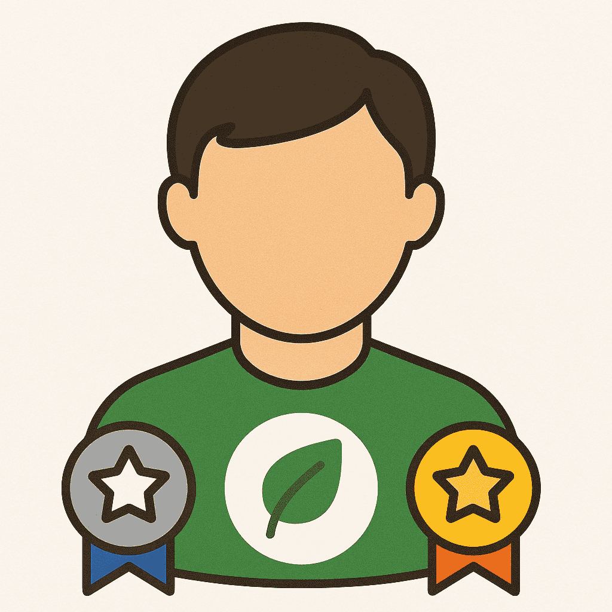
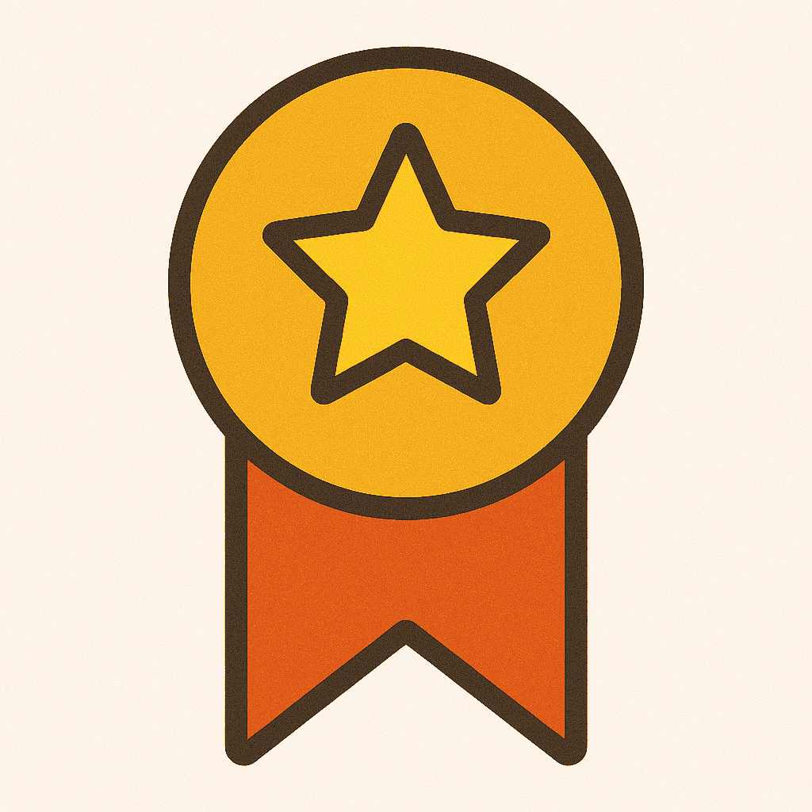
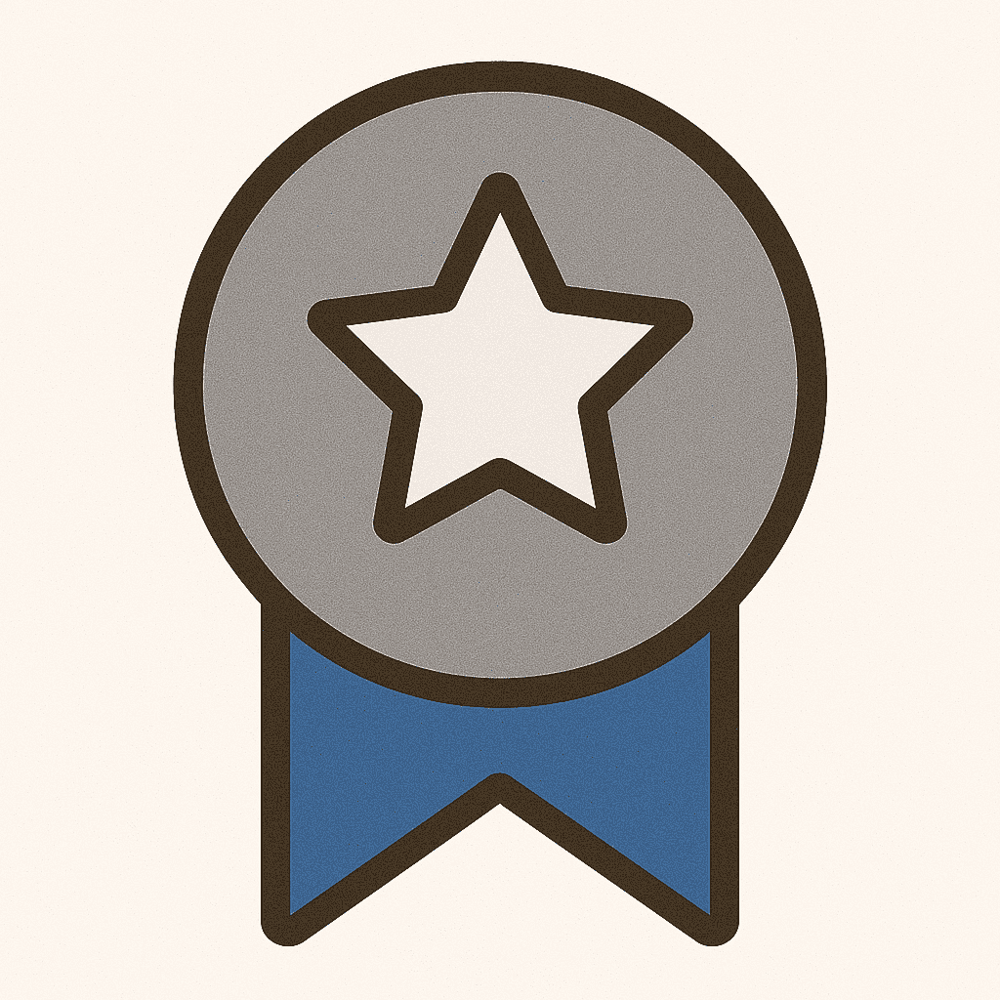
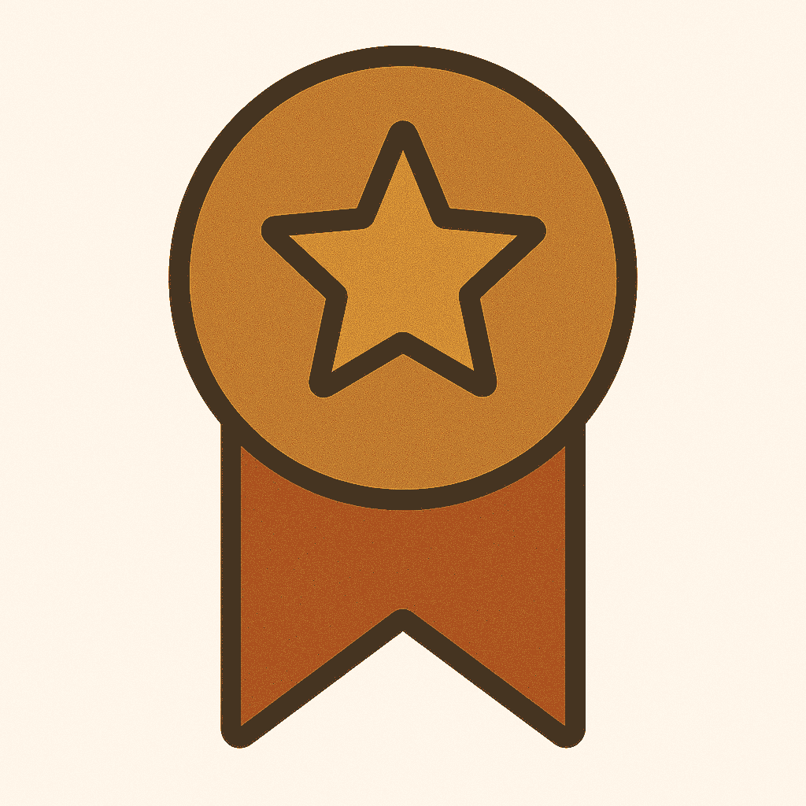
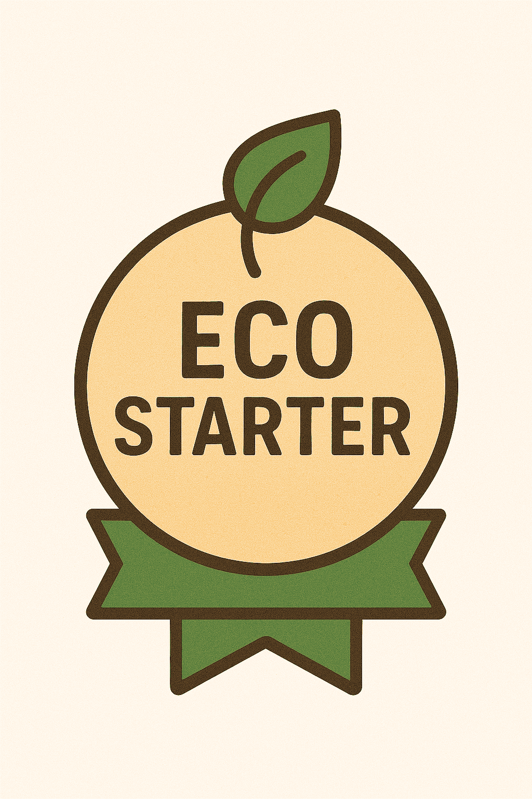
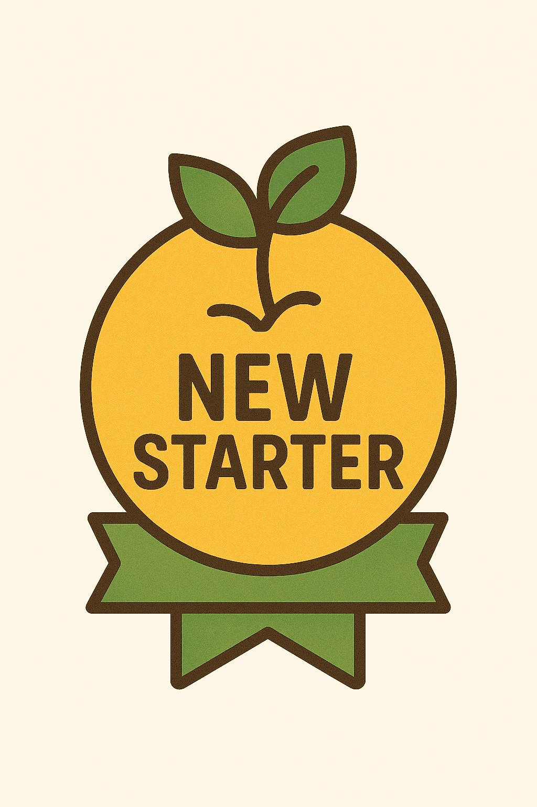

# 🌱 EcoTrack Local



[](https://github.com/frankTheCodeBoy/EcoTrack-local/actions/workflows/ci.yml)
[](https://github.com/frankTheCodeBoy/EcoTrack-local/actions/workflows/lint.yml)

**Track your impact. Level up your habits. Empower your community.**

_EcoTrack Local_ is a modular, open-source platform that gamifies environmental action. Log your eco-friendly habits, earn badges, build streaks, and visualize your progress — all while contributing to a collective movement for change.

---

## 🚀 Features

- ✅ **Action Logging** – Record daily eco-actions with one click  
- 📈 **Modular Dashboards** – Toggle chart types, personalize titles, and export insights  
- 🏅 **Badge System** – Unlock Bronze, Silver, and Gold tiers as you grow  
- 🔥 **Streak Tracking** – Stay motivated with daily streaks and profile highlights  
- 👤 **User Profiles** – View badges, streaks, and personal stats  
- 🖼️ **Custom Certificates** – Download personalized achievement certificates  
- 🔐 **Authentication** – Secure login, password reset, and profile editing flows  

---

## 🧩 Tech Stack

| Layer         | Tools Used                          |
|--------------|-------------------------------------|
| Backend       | Django, Python                      |
| Frontend      | HTML, CSS, Bootstrap, Chart.js      |
| Auth & Logic  | Django Auth, Custom Badge Logic     |
| Data Viz      | Chart.js, Exportable Dashboards     |
| PDF Gen       | ReportLab (for certificates)        |

---

## 🎮 Badge Logic

| Badge Tier       | Actions Required |
|------------------|------------------|
| 🌱 Newcomer       | 0                |
| 🎉 Eco Starter    | 1–9              |
| 🥉 Bronze         | 10–24            |
| 🥈 Silver         | 25–49            |
| 🏅 Gold           | 50+              |

### 🎨 Badge Previews

<div style="display: flex; flex-wrap: wrap; gap: 8px; margin-top: 6px;">       </div>

Earn badges as you grow, compete with friends, and unlock exciting rewards — every action counts toward your eco-legacy. Badges upgrade automatically when users log new actions. Streaks and badge levels are displayed on profile pages.

---

## 📜 Certificate Generation

Celebrate your progress with downloadable certificates!  
Each certificate includes:

- Your name and username  
- Total eco-actions logged  
- Badge tier and streak status  
- Verified timestamp and project branding  

Certificates are generated dynamically and can be shared or printed.

---

## 📦 Installation

```bash
git clone https://github.com/frankTheCodeBoy/EcoTrack-local.git
cd EcoTrack-local
pip install -r requirements.txt
python manage.py migrate
python manage.py runserver
```

---

## 🌐 Live Demo

EcoTrack Local is now live! 🚀  
Explore the platform and start tracking your impact at:  
🔗 [ecotracklocal.pythonanywhere.com](https://ecotracklocal.pythonanywhere.com/)

Join the movement—log in, take action, and see your progress come to life.  
Every eco-step counts, and your journey starts here. 🌱

---

## 🤝 Contributing

EcoTrack Local is built for collaboration. Whether you're a developer, designer, or activist — your ideas matter.

- Fork the repo  
- Create a feature branch  
- Submit a pull request with clear documentation  

---

## 💡 Vision

EcoTrack Local aims to become a **community-powered advocacy platform**:

- Regional leaderboards  
- Local impact tracking  
- Viral onboarding and gamified engagement  
- Certificate sharing and eco-recognition  

Let’s build tools that inspire real-world change.

---

## 📫 Contact

Built with 💚 by [Frank Olum](https://github.com/frankTheCodeBoy)

Got feedback or ideas? Open an issue or reach out!

---

## 📄 License

This project is licensed under the **MIT License**.  
You’re free to use, modify, and distribute — just give credit where it’s due.

---
